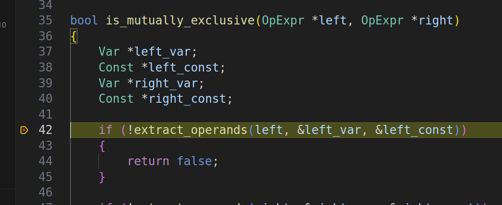
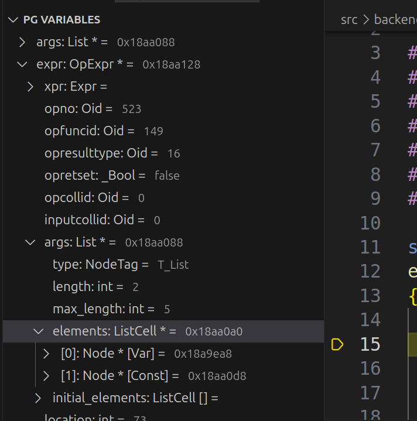
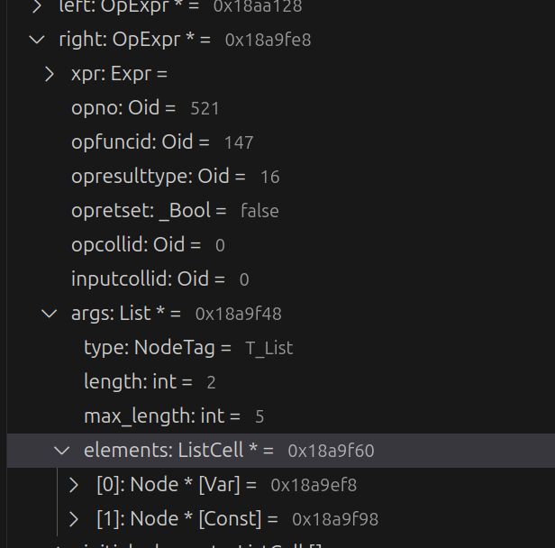
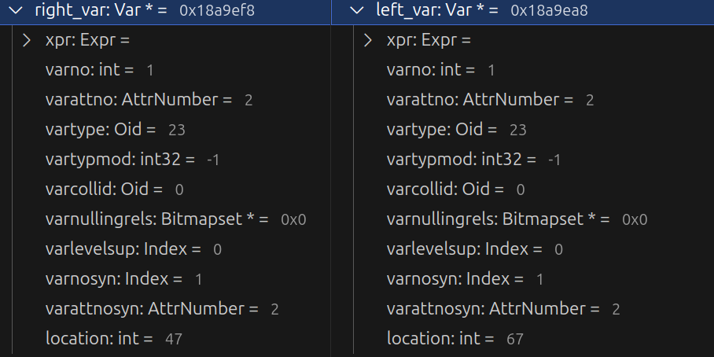
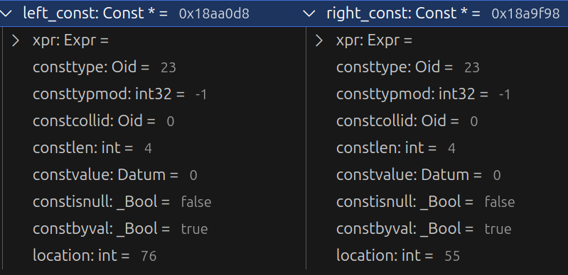
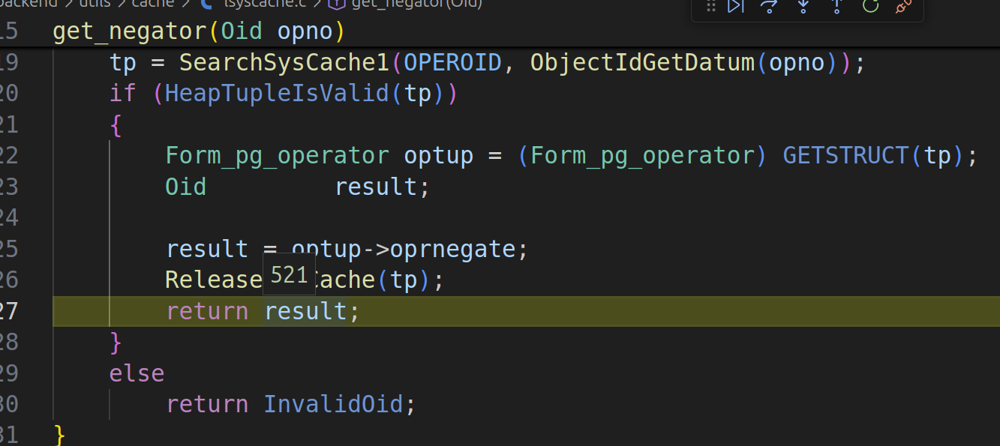
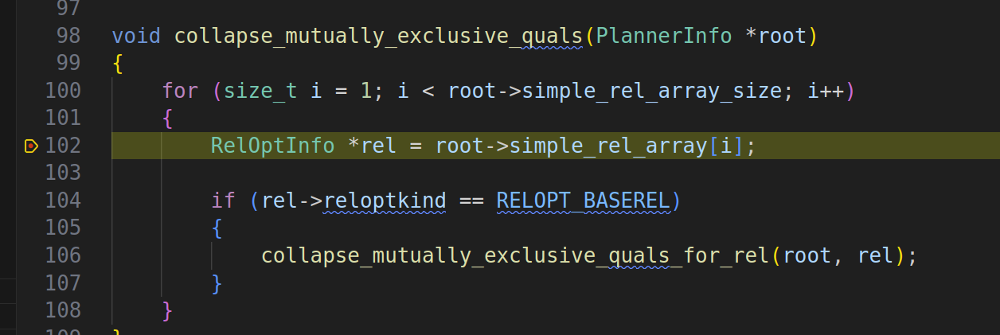
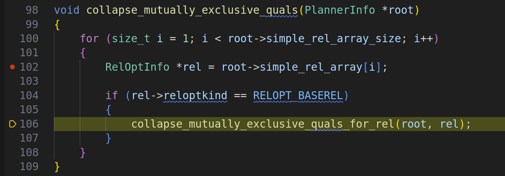
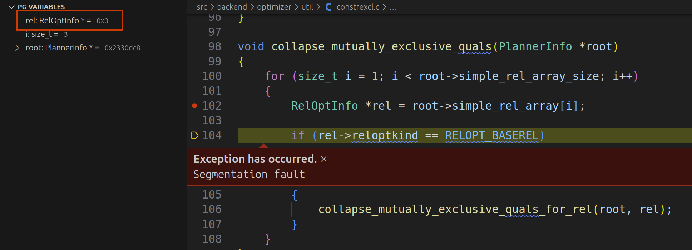
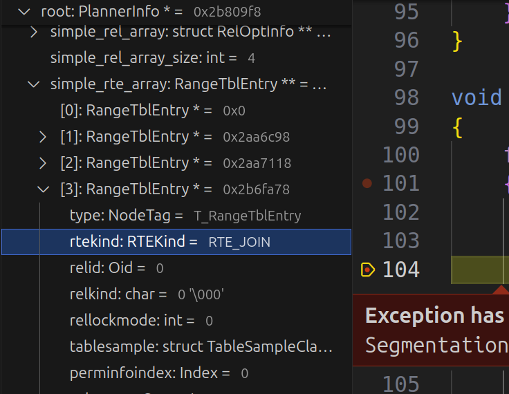

# Отлаживаем планировщик Postgres

В этом докладе рассмотрим то, как работает планировщик, но на уровне исходного
кода: функции и структуры данных. Кратко пробежимся по основным из них. Коснемся
такой темы как узлы (Node) - основ

### Подготовка

Для настройки репозитория для доклада необходимо запустить скрипт `init_repo.sh`.

Этот скрипт:

1. Скачает PostgreSQL 16.4
2. Применит к нему патч для настройки окружения к докладу
3. Скопирует скрипты для разработки
4. Если установлен VS Code:
    1. Скопирует файлы конфигурации в `.vscode`
    2. Установит необходимые расширения

> Для скачивания исходников необходимы либо `wget`, либо `curl` (скачивание архива с исходным кодом), а также
> `tar` (разархивирование). Если они отсутствуют, то просьба скачать этот архив
> самостоятельно. Необходимы файлы версии 16.4. Можно скачать по этой ссылке -
> [https://ftp.postgresql.org/pub/source/v16.4/postgresql-16.4.tar.gz](https://ftp.postgresql.org/pub/source/v16.4/postgresql-16.4.tar.gz).
> Архив положить в эту директорию и запустить скрипт `init_repo.sh` заново.

Для сборки и отладки с текущим скриптом необходимо установить:

- `libreadline`
- `bison`
- `flex`
- `make`
- `gcc`
- `gdb` (или другой отладчик)
- `CPAN` (для PERL)

Установить их можно:

```shell
# Debian based
sudo apt update
sudo apt install build-essential gdb bison flex libreadline-dev

# RPM based
sudo yum update
sudo yum install gcc gdb bison flex make readline-devel perl-CPAN
```

Ссылка на архив с 16.4 версией -
[https://ftp.postgresql.org/pub/source/v16.4/postgresql-16.4.tar.gz](https://ftp.postgresql.org/pub/source/v16.4/postgresql-16.4.tar.gz).

Настройку окружения можно произвести следующим образом (запуск **не** от root'а):

```shell
# Запускаем скрипт инициализации репозитория: скачивание файлов,
# применение патчей, установка расширений VS Code и т.д.
./init_repo.sh

# Переходим в директорию с исходным кодом
cd postgresql

# Запускаем сборку (параллельно 8 воркеров, можно убрать)
./dev/build.sh -j 8

# Настраиваем схему БД
./dev/run.sh --init-db --run-db --psql --script=../schema_constrexcl.sql --stop-db

# Запускаем VS Code и открываем необходимые вкладки (если есть)
code . --goto src/backend/optimizer/util/constrexcl.c  \
        --goto src/backend/optimizer/util/clauses.c    \
        --goto src/backend/optimizer/plan/planmain.c
```

После этого можно запускать PSQL и выполнять скрипты из `queries_constrexcl.sql`.

Работа будет производиться в файлах (можно открыть предварительно):

- `src/backend/optimizer/util/constrexcl.c`
- `src/backend/optimizer/util/clauses.c`
- `src/backend/optimizer/plan/planmain.c`

> Если VS Code установлен ПОСЛЕ запуска скрипта настройки, то следует скопировать
> директорию `.vscode` в директорию с файлами БД (`postgresql`) вручную:
> `cp -r .vscode postgresql`. В ней находятся файлы конфигурации для
> VS Code.

Для полноценной отладки, необходимо установить дополнительно:

- `icu-i18n`
- `zstd`
- `zlib`
- `pkg-config`

И пакет PERL `IPC::Run`

## Высокоуровневая архитектура планировщика

### Алгоритм обработки запроса

В начале вспомним процесс обработки запроса. Алгоритм можно представить в виде 4
этапов:

1. Парсинг запроса
2. Переписывание запроса
3. Работа планировщика
4. Исполнение запроса


Сегодня поговорим именно о 3 этапе – работе планировщика.

Рассмотрим общий вид на то, как работает планировщик.
Его работу также можно поделить на несколько 4 этапа:

1. Предобработка дерева запроса
2. Оптимизация
3. Нахождение возможных путей выполнения
4. Выбор наиболее оптимального плана выполнения

Первые 2 этапа – это оптимизации. Разница заключается в том, что в 1 этапе мы
работаем только с деревом запроса и выполняем простые оптимизации, например,
constant folding (вычисляем выражения с константными значениями). А во 2 этапе
применяются уже более сложные оптимизации. Как правило они связаны со знаниями
о всем запросе (join'ы, ограничения, партиции и т.д.)

3 этап – мы находим все возможные пути выполнения запроса, используя знания
полученные после всех оптимизаций.

Последний 4 этап – строим план выполнения из самого дешевого пути.

### Организация в исходном коде

Говоря об исходном коде, это организовано следующим образом.

- `query_planner` – планировщик для создания путей доступа к самим таблицам,
    т.е. создает узлы Scan методов (SeqScan, IndexScan и т.д.)
- `grouping_planner` – обертка над `query_planner`, ответственная за добавление
    логики постобработки кортежей (сортировка, группировка). Грубо говоря,
    декорирует узлы чтения нужной логикой
- `subquery_planner` – входная точка для планирования 1 запроса: подготавливает
    запрос для `grouping_planner` и вызывает его
- `standard_planner` – входная точка самого планировщика

Схематично, это можно отобразить так.

На самом верху имеется `standard_planner`. Он подготавливает окружение и после
вызывает `subquery_planner` для самого высокоуровнего запроса.

`subquery_planner`: предобрабатывает *дерево запроса* и вызывает
`grouping_planner` для анализа всего запроса, а после создает план для самого
дешевого пути.

`grouping_planner`: отвечает за логику обработки прочитанных кортежей:
сортировка, группировка, оконные функции и т.д.

`query_planner`: инициализирует состояние планировщика и находит возможные
методы доступа к таблице.

```c
standard_planner()
{
    /* Инициализируем глобальное состояние планировщика */
    subquery_planner()
    {
        /* Предобработка дерева запроса */
        grouping_planner()
        {
            /* Настройка операций обработки данных */
            query_planner()
            {
                /* Инициализация планировщика */
                /* ... */
                /* Создание путей обхода таблиц */
            }
            /* Добавление узлов обработки данных (сортировка, группировка и т.д.) */
        }
        /* Выбор самого дешевого пути */
    }
    /* Создание плана выполнения */
}
```

`subquery_planner` - запускается для каждого обнаруженного подзапроса, причем
верхнеуровневый запрос - тоже подзапрос, просто у него не родителя.


## Используемые структуры данных

Теперь поговорим о структурах данных.

### Узлы и деревья

Многие структуры данных в Postgres являются узлами - `Node`. Первое поле у
каждого узла - это `NodeTag`, дискриминатор типа. Это простой enum, который
составляется как префикс `T_` + название типа.

Все возможные узлы уже известны и их значения определяются в `src/include/nodes/node.h`,
либо, начиная с 16 версии автоматически генерируются в `src/include/nodes/nodetags.h`.

Реализации узлов находятся в заголовочных файлах в `src/include/nodes`. Эти файлы
оканчиваются на `*nodes.h`:

- `src/include/nodes/primnodes.h`
- `src/include/nodes/pathnodes.h`
- `src/include/nodes/plannodes.h`
- `src/include/nodes/execnodes.h`
- `src/include/nodes/memnodes.h`
- `src/include/nodes/miscnodes.h`
- `src/include/nodes/replnodes.h`
- `src/include/nodes/parsenodes.h`
- `src/include/nodes/supportnodes.h`

### Какие бывают узлы

На этой схеме представлено дерево этих узлов. Все не уместились - их около 500, поэтому
рассмотрим основные. (С версии 8.0 до 17 уникальных - 555).


`List` - это список (как связный список). Хранить он может в себе `Node *`, `int`,
`Oid` или `TransactionId`, но только одного типа. Достигается это тем, что
у списка есть отдельный тэг для каждого типа:

| Тип             | Тэг         |
| --------------- | ----------- |
| `Node *`        | `T_List`    |
| `int`           | `T_IntList` |
| `Oid`           | `T_OidList` |
| `TransactionId` | `T_XidList` |

Но при этом, название типа одно и то же - `List`.

`Bitmapset` - это множество чисел.

`Expr` - это базовый тип для узлов, которые могут быть выполнены. Примеры:

| Тип        | Описание             | Результат выполнения             |
| ---------- | -------------------- | -------------------------------- |
| `Var`      | Атрибут таблицы      | Значение атрибута из кортежа     |
| `Const`    | Константа            | Значение константы               |
| `OpExpr`   | Оператор             | Вызов оператора с аргументами    |
| `FuncExpr` | Функция              | Вызор функции с аргументами      |
| `BoolExpr` | Логическое выражение | Выполнение логического выражения |
| `SubPlan`  | Подзапрос            | Результат запроса                |

> `Node` и `Expr` - это псевдоузлы, в том понимании, что у них нет своего тэга.
> Они служат только маркерами: `Node` - это узел, `Expr` - это вычисляемый узел.

### Структуры данных планировщика

Теперь поговорим о представлении запроса в коде.

Весь запрос - это множество подзапросов. Даже если их нет, то весь запрос - это
один большой подзапрос.

`PlannerGlobal` - хранит информацию о всем запросе. Используется не так часто, например, для назначения нового
    глобального ID для `PlaceHolderVar` (поле `lastPHId`). Создается в самом начале -
    в функции `standard_planner`

`PlannerInfo` - хранит информацию об одном запросе. Рекурсивно создается и для каждого подзапроса. Создается в `subquery_planner`.

`RelOptInfo` - информация планировщика об отношении. Отношением (relation) могут быть
    таблицы, SRF (set returning function), подзапросы, CTE, JOIN'ы и т.д.
    Основная работа планировщика ведется с ними. Также есть и брат - `IndexOptInfo` -
    информация об индексе.

`RestrictInfo` - какое-либо ограничение. Это может быть условие из WHERE или JOIN'а.
    Всякие ограничения в коде называются `qualification` (сокращенно `qual`).

На схеме изображено отношение между частями запроса и структур данных, ответственных за них.


Еще одна важная абстракция - `Range Table`.

Грубо говоря, `Range Table` - это все, что находится в выражении `FROM`,
список используемых источников данных для запроса. Каждый такой элемент
называется Range Table Entry. Ими могут быть:

- Таблица
- Функция
- Другой подзапрос
- `JOIN`'ы
- CTE
- `VALUES`

`RangeTblEntry` - это структура, представляющая Range Table Entry. Типы таких
RTE определяются перечислением `RTEKind` (значения начинаются с `RTE_`).

На схеме изображены RTE, участвующие во `FROM` и их типы:


Заметьте, что таблицы, функции и подзапросы имеют как минимум 2 общие черты:
у них есть название (чтобы к ним обращаться) и список возвращаемых атрибутов.
Такие отношения называют базовыми, в оригинале base relation или base rel.

`RelOptInfo` определяется не `RTEKind`, типом источника данных, а `RelOptKind` -
типом отношения. И этот `RelOptKind` может нам сказать, что это отношение базовое.
Для них есть отдельное значение `RELOPT_BASEREL`.

На схеме можно видеть примерное соотношение между `RTEKind` и `RelOptKind`:


## Реализуем Constraint Exclusion

Теперь мы знаем достаточно, чтобы работать с планировщиком.

Предлагаю реализовать Constraint Exclusion - это оптимизация, которая учитывает наложенные ограничения на запрос.

### Постановка задачи

Для конкретики - мы хотим учитывать допустимый диапазон возможных значений.
Например, если в `WHERE` имеется `AND` со сравнениями атрибутов, то этот атрибут
не может быть одновременно больше и не больше определенной константы. Вот этим
и займемся.

Например, такой запрос не может вернуть нам ничего:

```sql
SELECT * FROM tbl1
WHERE 
    value > 0 
  AND
    value <= 0;
```

### Проектируем решение

Первым шагом поймем что мы будем искать. Нам нужно найти следующий шаблон узлов
в коде.


Мы ищем:

- `BoolExpr` - булево выражение с условием `AND`, у которого
- Оба выражения - `OpExpr`, вызовы оператора, имеющие
- разные только операторы (противоположные), где у каждого вызова оператора
- слева - столбец таблицы, `Var`, а
- справа - константа, `Const`, причем
- соответствующие операнды равны между собой

Если мы обнаружили такой паттерн, то можем сказать, что этот запрос можно убрать из рассмотрения - он ничего не вернет.

В примере, это численное сравнение - никакое число не может быть одновременно
и больше и не больше 0.

Для простоты будем искать только их - без `OR`, `NOT`, обнаружения перестановок
операндов и прочего. Только `AND`, столбцы и константы со строгим порядком.

### Реализация

Для начала спроектируем вспомогательную функцию - она будет получать `Var` и
`Const` из переданного `OpExpr`.

Первым делом определим, что по обе стороны оператора - столбец таблицы и константа.
Оператор - это тоже функция с аргументами. Аргументы хранятся в поле `args`.
Так как мы ищем бинарные операторы, то длина `args` должна равняться 2. Для получения длины списка существует функция `list_length`.

```c++
if (list_length(expr->args) != 2)
{
    return false;
}
```

Аргументы следуют в порядке вызова. В нашем случае первый аргумент должен быть
столбцом, а второй - константой. Столбец таблицы выражается узлом `Var`, а
константа - `Const`.

Для проверки тэга узла используется макрос `IsA(nodeptr, type)`. Для получения
первого и последнего элемента списка используется макрос `linitial` и `llast`
соответственно:

```c++
/* Первый аргумент - столбец таблицы */
if (!IsA(linitial(args), Var))
{
    return false;
}

/* Второй аргумент - константа */
if (!IsA(llast(args), Const))
{
    return false;
}

*out_var = (Var *) linitial(args);
*out_const = (Const *) llast(args);
```

В итоге, вспомогательная функция для получения операндов выглядит следующим образом:

```c++
static bool
extract_operands(OpExpr *expr, Var **out_var, Const **out_const)
{
    /* Должно быть ровно 2 аргумента */
    if (list_length(expr->args) != 2)
    {
        return false;
    }

    /* Первый аргумент - столбец таблицы */
    if (!IsA(linitial(expr->args), Var))
    {
        return false;
    }

    /* Второй аргумент - константа */
    if (!IsA(llast(expr->args), Const))
    {
        return false;
    }

    *out_var = (Var *) linitial(expr->args);
    *out_const = (Const *) llast(expr->args);
    return true;
}
```

Перейдем к реализации основной логики. Она будет находится в функции `is_mutually_exclusive`.
Она работает следующим образом: на вход принимает 2 `OpExpr` (вызовы операторов) и
проверяет, что они подходят под шаблон (см. выше) и если так, то возвращает `true`.

В начале воспользуемся написанной ранее функцией и получим обе части операторов.

```c
Var *left_var;
Const *left_const;
Var *right_var;
Const *right_const;

if (!extract_operands(left, &left_var, &left_const))
{
    return false;
}

if (!extract_operands(right, &right_var, &right_const))
{
    return false;
}
```

Теперь для каждого из выражений необходимо проверить, что соответствующие
операнды равны. Для сравнения узлов используется функция `equal`.

> На вход она принимает 2 `void` указателя, но на самом деле работает только с узлами.

```c++
/* Столбцы принадлежат одному и тому же отношению */
if (!equal(left_var, right_var))
{
    return false;
}

/* Константы равны */
if (!equal(left_const, right_const))
{
    return false;
}
```

Последний этап - проверка операндов, они должны быть противоположными.
Мы воспользуемся системным каталогом `pg_operator`. Нам нужен столбец
`oprnegate`, который содержит Oid противоположного оператора.

В заголовочном файле `utils/cache/lsyscache.c` находится
множество полезных и часто используемых функций для работы с системным
каталогом. Нас интересует функция `get_negator` - она по переданному `Oid`
оператора возвращает `Oid` соответствующего ему противоположного оператора.
Для `<` это будет `<=`.

Добавим только 1 проверку. Предполагаем, что если негатор левого оператора - равен правому, то и негатор правой части - левому. То есть они симметричны, что вполне логично.

```c++
return get_negator(left->opno) == right-opno;
```

В результате, функция выглядит таким образом:

```c
static bool
is_mutually_exclusive(OpExpr *left, OpExpr *right)
{
    Var *left_var;
    Const *left_const;
    Var *right_var;
    Const *right_const;

    if (!extract_operands(left, &left_var, &left_const))
    {
        return false;
    }
    if (!extract_operands(right, &right_var, &right_const))
    {
        return false;
    }
    
    if (!equal(left_var, right_var))
    {
        return false;
    }
    
    if (!equal(left_const, right_const))
    {
        return false;
    }

    return get_negator(left->opno) == right->opno;
}
```

Теперь осталось добавить эту логику в нужное место. Вначале добавим в 1 этап
работы планировщика - предобработка дерева запроса.

Первая часть `subquery_planner` - это предобработка дерева запроса с его
оптимизацией в возможным переписыванием. Основная логика предобработки находится в
`preprocess_expression` - это обобщенная функция, которая проходит по узлам и
выполняет общую предобработку: вычисление константных выражений, приведение к
каноническому виду и другие.

Нас интересует `simplify_and_arguments` - она вызывается из `preprocess_expression`.
Она ответственна за оптимизацию условий из `AND` выражения.

Устроена следующим образом. Ей передается список из условий в `AND` выражении
(если есть несколько вложенных AND, то они все превращаются в 1 список) и она
создает новый список поочередно обрабатывая каждый элемент из старого.

Также есть возвращаемый флаг `forceFalse` - если он будет выставлен, то весь список
условий заменяется на константный `FALSE`. Этим мы и воспользуемся.

Таким образом наша часть логики будет устроена так: проверяем что текущий и
предыдущий элементы - `OpExpr`, а после проверяем, что они взаимоисключающие и
если так, то выставляем этот (`forceFalse`) маркер.

Добавим нашу логику в конец `while` перед добавлением текущего элемента в новый список
(часть функции удалена для удобства):

```c
static List *
simplify_and_arguments(List *args,
                       eval_const_expressions_context *context,
                       bool *haveNull, bool *forceFalse)
{
    /* ... */
    while (unprocessed_args)
    {
        /* ... */
        /* Предыдущий и текущий выражения должны быть вызовами операторов */
        if (IsA(arg, OpExpr) && newargs != NIL && IsA(llast(newargs), OpExpr))
        {
            /* Проверка на взаимоиключение */
            if (is_mutually_exclusive((OpExpr *)arg, (OpExpr *)llast(newargs)))
            {
                /* Говорим, что все условия можно заменить на FALSE */
                *forceFalse = true;
                return NIL;
            }
        }
        
        newargs = lappend(newargs, arg);
    }

    return newargs;
}
```

Проверим результат. Представим, что у нас имеется подобная схема:

```sql
CREATE TABLE tbl1(
    id BIGINT GENERATED ALWAYS AS IDENTITY,
    value INTEGER
);
CREATE TABLE tbl2(
    id BIGINT GENERATED ALWAYS AS IDENTITY,
    value INTEGER
);
```

> Для запуска БД и/или PSQL можно воспользоваться скриптом `./dev/run.sh --init-db --run-db --psql`,
> либо в VS Code таской `Run psql`

И тестовый запрос:

```sql
EXPLAIN ANALYZE 
SELECT * FROM tbl1 
WHERE
    value > 0
  AND
    value <= 0;
```

Для начала запустим запрос без наших изменений.

```text
                                          QUERY PLAN                                           
-----------------------------------------------------------------------------------------------
 Seq Scan on tbl  (cost=0.00..43.90 rows=11 width=4) (actual time=0.004..0.004 rows=0 loops=1)
   Filter: ((value > 0) AND (value <= 0))
 Planning Time: 0.186 ms
 Execution Time: 0.015 ms
(4 rows)
```

Видно, что мы действительно выполнили сканирование таблицы с примененным фильтром.
Теперь соберем вместе с нашими изменениями.

> Для сборки можно использовать скрипт `./dev/build.sh`, либо в VS Code таску `Build` или сочетание клавиш `Ctrl + Shift + B`.
>
> Перед запуском не забудьте остановить БД. Сделать это можно скриптом `./dev/run.sh --stop-db`,
> либо в VS Code таской `Stop DB`

И запустим запрос заново:

```text
                                     QUERY PLAN                                     
------------------------------------------------------------------------------------
 Result  (cost=0.00..0.00 rows=0 width=0) (actual time=0.001..0.002 rows=0 loops=1)
   One-Time Filter: false
 Planning Time: 0.033 ms
 Execution Time: 0.013 ms
(4 rows)
```

По выводу PSQL видим, что весь запрос заменен пустым выводом:

- `Result` - узел возвращающий готовые значения
- `One-Time Filter: false` - единовременный фильтр, отклоняющий все записи

Давайте запустим отладчик и проверим, как работает логика. Поставим точку останова
в начале функции `is_mutually_exclusive`, подключимся отладчиком.

> Для подключения отладчиком необходимо:
>
> 1. Получить PID бэкнэда - выполнить запрос `select pg_backend_pid();` в запущенном
>    psql (если использовать скрипты из этого репозитория, то он автоматически появится
>    сразу после запуска PSQL)
> 2. Начать отладку в VS Code, например, нажать F5
> 3. Ввести в высветившееся окно ввести полученный на 1 шаге PID
> 4. При необходимости, ввести пароль

Запустим наш запрос и вот мы попали в нашу функцию.



Сделаем шаг внутрь функции `extract_operands`. Посмотрим, что внутри переданного
`OpExpr`.
Раскрываем его содержимое и видим множество полей. Сейчас надо посмотреть, что
находится внутри поля `args`, т.е. аргументов оператора.



Видим, что у него 2 элемента: первый - `Var`, столбец таблицы, а второй - `Const`,
константа. Значит, наша логика получения элементов должна сработать успешно.
Доходим до конца функции - значит, все правильно.

Далее выходим из этой функции обратно и смотрим, что внутри другого `OpExpr`,в переменной `right`.



В нем та же картина - 2 аргумента - `Var` и `Const`.
Делаем несколько шагов и останавливаемся около `equal`. Эта функция должна проверить
равенство `Var`. Давайте вручную проверим их равенство. Открываем оба `Var`



Смотрим на поля и убеждаемся, что они равны.
Различаются только поля `location`, но они нужны только для отладки, то есть проверка должна пройти.
Делаем шаг - проверка прошла успешно.
На всякий случай, проверим еще и равенство `Const` вручную.



Они также равны.

Последний шаг - проверка противоположных операторов. Oid операторов хранится в поле `opno`. Посмотрим на Oid правого оператора - он равен 521. Теперь спустимся в функцию `get_negator` и дойдем до `return`, чтобы посмотреть, чему равен негатор левой части.




Он равен 523, то есть Oid правой части. Таким образом и работает наша логика.

Но у размещения логики на этапе предобработки дерева запроса есть недостаток -
он учитывает условия только в `WHERE`. Вот такой запрос оптимизирован не будет:

```sql
EXPLAIN ANALYZE
SELECT * FROM tbl1 t1 
    JOIN tbl2 t2 
       ON t1.value > 0 
    WHERE t1.value <= 0;
```

Это может исправить планировщик, знающий о таких ограничениях. Следующее место,
куда мы добавим оптимизацию во 2 этап работы планировщика, сделаем эту оптимизацию частью
его работы.

Грубо говоря, работа планировщика начинается в `query_planner`, так как там
инициализируются поля `PlannerInfo`, необходимые для работы планировщика. Нас
интересует `simple_rel_array` - массив, который хранит в себе `RelOptInfo`.
Напомню, что `RelOptInfo` - это структура, представляющая информацию о таблице.

Новая логика будет работать аналогично той, что была в предобработке дерева запроса:
проходим весь список ограничений и, когда находим взаимоисключающие, заменяем весь
список на список из единственного `FALSE`.

В `RelOptInfo` нам нужно работать с полем `baserestrictinfo` - список из
ограничений, наложенных на таблицу. Если в JOIN'е были условия, которые относились
только к 1 таблице, то они попадут в этот список вместе с условиями из `WHERE`.

Напишем функцию, которая будет применять логику к одному `RelOptInfo` - обходим
весь список ограничений и, когда находим 2 рядом стоящих `OpExpr` подходящих под
шаблон, заменяем весь список на список из единственного `FALSE`.
Ее сигнатура будет следующей:

```c
static void
collapse_mutually_exclusive_quals_for_rel(PlannerInfo *root, RelOptInfo *rel)
{
}
```

Вначале, проверим что у нас как минимум 2 ограничения (условия). В противном случае,
находить нечего.

```c
static void
collapse_mutually_exclusive_quals_for_rel(PlannerInfo *root, RelOptInfo *rel)
{
    /* Как минимум 2 условия */
    if (list_length(rel->baserestrictinfo) < 2)
    {
        return;
    }
}
```

Теперь начнется основная логика. Нам необходимо пройтись по всему списку и обнаружить 2 рядом стоящих взаимоисключающих `OpExpr`.
Для упрощения кода, мы сразу прочитаем первый элемент этого списка и итерироваться начнем с 1 (индексация с 0).

```c
static void
collapse_mutually_exclusive_quals_for_rel(PlannerInfo *root, RelOptInfo *rel)
{
    ListCell *lc;
    RestrictInfo *prev_rinfo;

    /* Получаем первый элемент */
    prev_rinfo = linitial(rel->baserestrictinfo);

    /* Итерируемся со 2 */
    for_each_from(lc, rel->baserestrictinfo, 1)
    {
        /* Читаем очередной элемент */
        RestrictInfo *cur_rinfo = (RestrictInfo *)lfirst(lc);
        /* ... */
    }
}
```

В 1-ой итерации цикла нам необходимо выполнить проверку - предыдущий и текущий `OpExpr` взаимоисключающие.
Это мы сделаем за 2 шага: проверим, что оба условия - `OpExpr`, и проверим, что они взаимоисключающие (ранее написанная функция).

```c
static void
collapse_mutually_exclusive_quals_for_rel(PlannerInfo *root, RelOptInfo *rel)
{
    /* ... */

        /* Оба выражения - вызовы операторов */
    if (IsA(prev_rinfo->clause, OpExpr) && IsA(cur_rinfo->clause, OpExpr) &&
        /* Выражения взаимоисключающие */
        is_exclusive_range((OpExpr *)prev_rinfo->clause, (OpExpr *)cur_rinfo->clause))
    {
        /* ... */
    }
}
```

Осталось только заменить весь список условий, на список из 1 константного `FALSE`.
Здесь нам понадобятся 2 функции для создания узлов: `make_restrictinfo` - для
создания `RestrictInfo` (ограничения) и `makeBoolConst` - для создания константного
`boolean`.

```c
static void
collapse_mutually_exclusive_quals_for_rel(PlannerInfo *root, RelOptInfo *rel)
{
    /* ... */

    /* Создаем ограничение */
    RestrictInfo *false_rinfo = make_restrictinfo(root,
                                                  /* Создаем константый `FALSE` */
                                                  (Expr *)makeBoolConst(false, false),
                                                  false, false, false, false,
                                                  0, NULL, NULL, NULL);
    /* Создаем список из 1 элемента */
    rel->baserestrictinfo = list_make1(false_rinfo);
}
```

Осталось добавить обновление предыдущего элемента после каждой итерации.
Вся функция выглядит следующим образом:

```c
static void
collapse_mutually_exclusive_quals_for_rel(PlannerInfo *root, RelOptInfo *rel)
{
    ListCell *lc;
    RestrictInfo *prev_rinfo;

    if (list_length(rel->baserestrictinfo) < 2)
    {
        return;
    }

    prev_rinfo = linitial(rel->baserestrictinfo);

    for_each_from(lc, rel->baserestrictinfo, 1)
    {
        RestrictInfo *cur_rinfo = (RestrictInfo *)lfirst(lc);
        if (IsA(prev_rinfo->clause, OpExpr) && IsA(cur_rinfo->clause, OpExpr) &&
            is_mutually_exclusive((OpExpr *)prev_rinfo->clause, (OpExpr *)cur_rinfo->clause))
        {
            RestrictInfo *false_rinfo = make_restrictinfo(root,
                                                          (Expr *)makeBoolConst(false, false),
                                                          false, false, false, false,
                                                          0, NULL, NULL, NULL);
            rel->baserestrictinfo = list_make1(false_rinfo);
            return;
        }
        
        prev_rinfo = cur_rinfo;
    }
}
```

В каждом запросе может быть несколько отношений. Поэтому применить эту логику
стоит ко всем ним.
`RelOptInfo` хранятся в массиве `simple_rel_array` структуры `PlannerInfo`.
Нам нужно просто обойти каждый элемент этого массива и применить `collapse_mutually_exclusive_quals_for_rel`.

Функция логикой обхода содержится в `collapse_mutually_exclusive_quals`.
Ее сигнатура:

```c
void 
collapse_mutually_exclusive_quals(PlannerInfo *root)
{
}
```

Нам необходимо пройти весь массив `simple_rel_array`. Здесь стоит учесть, что
его индексация начинается с 1, на 0 индексе всегда NULL.

```c
void 
collapse_mutually_exclusive_quals(PlannerInfo *root)
{
    /* Индексация с 1, не с 0 */
    for (size_t i = 1; i < root->simple_rel_array_size; i++)
    {
        RelOptInfo *rel = root->simple_rel_array[i];
    }
}
```

`RelOptInfo` может быть создан как для таблиц, так и для `JOIN`'ов, функций или индексов.
Поэтому нам необходимо проверить тип этого отношения.
Мы могли бы проверить, что перед нами таблица, но лучше использовать другой подход -
проверять, что перед нами base rel. Ими могут быть не только таблицы, но и
функции или подзапросы. Логика Constraint Exclusion может применяться и к ним.

Поэтому будем проверять, что перед нами base rel. Таким образом, мы расширим круг
применения оптимизации.
Эта информация хранится в поле `reloptkind` структуры `RelOptInfo`

```c
void 
collapse_mutually_exclusive_quals(PlannerInfo *root)
{
    for (size_t i = 1; i < root->simple_rel_array_size; i++)
    {
        RelOptInfo *rel = root->simple_rel_array[i];
        
        /* Проверяем, что отношение базовое, base rel */
        if (rel->reloptkind == RELOPT_BASEREL)
        {
            collapse_mutually_exclusive_quals_for_rel(root, rel);
        }
    }
}
```

Все функции вместе:

```c
static void
collapse_mutually_exclusive_quals_for_rel(PlannerInfo *root, RelOptInfo *rel)
{
    ListCell *lc;
    RestrictInfo *prev_rinfo;

    if (list_length(rel->baserestrictinfo) < 2)
    {
        return;
    }

    prev_rinfo = linitial(rel->baserestrictinfo);

    for_each_from(lc, rel->baserestrictinfo, 1)
    {
        RestrictInfo *cur_rinfo = (RestrictInfo *)lfirst(lc);

        if (IsA(prev_rinfo->clause, OpExpr) && IsA(cur_rinfo->clause, OpExpr) &&
            is_mutually_exclusive((OpExpr *)prev_rinfo->clause, (OpExpr *)cur_rinfo->clause))
        {
            RestrictInfo *false_rinfo = make_restrictinfo(root,
                                                          (Expr *)makeBoolConst(false, false),
                                                          false, false, false, false,
                                                          0, NULL, NULL, NULL);
            rel->baserestrictinfo = list_make1(false_rinfo);
            return;
        }
        
        prev_rinfo = cur_rinfo;
    }
}

void 
collapse_mutually_exclusive_quals(PlannerInfo *root)
{
    for (size_t i = 1; i < root->simple_rel_array_size; i++)
    {
        RelOptInfo *rel = root->simple_rel_array[i];

        if (rel->reloptkind == RELOPT_BASEREL)
        {
            collapse_mutually_exclusive_quals_for_rel(root, rel);
        }
    }
}
```

Осталось понять куда эту логику добавлять:

1. Мы используем список `baserestrictinfo`
2. Этот список находится в `RelOptInfo`
3. Они сами хранятся в массиве `simple_rel_array`

Логично добавить эту логику тогда, когда будет проинициализирован массив `simple_rel_array`
с необходимыми `RelOptInfo`.
Этот массив создается в функции `add_base_rels_to_query`, а вызывается в функции `query_planner` в файле `planmain.c`.

Добавим нашу логику сразу после создания массива `simple_rel_array`.

```c
RelOptInfo *
query_planner(PlannerInfo *root,
			  query_pathkeys_callback qp_callback, void *qp_extra)
{
    /* ... */
    add_base_rels_to_query(root, (Node *) parse->jointree);

    /* Логика Constraint Exclusion */
    collapse_mutually_exclusive_quals(root);
}
```

> Не забываем удалить код из работы 1 этапа (предобработка дерева запрса) в файле `clause.c`

Останавливаем старую БД, перекомпилируем, запускаем PSQL и выполняем запрос:

```text
                                          QUERY PLAN                                           
-----------------------------------------------------------------------------------------------
 Seq Scan on tbl  (cost=0.00..43.90 rows=11 width=4) (actual time=0.007..0.008 rows=0 loops=1)
   Filter: ((value > 0) AND (value <= 0))
 Planning Time: 0.042 ms
 Execution Time: 0.020 ms
(4 rows)
```

Наш патч не сработал, планировщик все же решил использовать сканирование таблицы.

Давайте запустим отладчик и посмотрим, что произошло. Поставим точку останова в функции `collapse_mutually_exclusive_quals` и запустим запрос.



Пройдя несколько шагов замечаем, что проверка на размер списка `baserestrictinfo` не прошла.
Если посмотреть, что внути этого списка, то окажется, что он пуст (NULL - пустой список).


Причина этого следующая - практически все основные структуры как `PlannerInfo`
или `RelOptInfo` заполняются по мере работы, а не сразу. Мы предположили, что
раз `add_base_rels_to_query` создает этот массив, то и каждый элемент уже должен
быть проинициализирован, но это не так. Чтобы починить это, необходимо опустить
функцию ниже, туда где `baserestrictinfo` проинициализирован ограничениями - после
вызова `deconstruct_join_tree`.

```c
RelOptInfo *
query_planner(PlannerInfo *root,
			  query_pathkeys_callback qp_callback, void *qp_extra)
{
    /* ... */
    joinlist = deconstruct_jointree(root);

    /* Опустили вызов Constraint Exclusion */
    collapse_mutually_exclusive_quals(root);
}
```

Остановим БД, перекомпилируем и запустим запрос снова:

```text
                                     QUERY PLAN                                     
------------------------------------------------------------------------------------
 Result  (cost=0.00..0.00 rows=0 width=0) (actual time=0.001..0.002 rows=0 loops=1)
   One-Time Filter: false
 Planning Time: 0.125 ms
 Execution Time: 0.012 ms
(4 rows)
```

Логика применилась успешно.
Теперь, проверим поведение для запроса, где часть условий вынесена в `JOIN`:

```sql
EXPLAIN ANALYZE 
SELECT * FROM tbl1 t1 
JOIN tbl2 t2 
   ON t1.value > 0 
WHERE t1.value <= 0;
```

Запускаем запрос и получаем следующий результат:

```text
postgres=# EXPLAIN ANALYZE 
SELECT * FROM tbl1 t1 
JOIN tbl2 t2 
   ON t1.value > 0 
WHERE t1.value <= 0;
server closed the connection unexpectedly
        This probably means the server terminated abnormally
        before or while processing the request.
The connection to the server was lost. Attempting reset: Failed.
The connection to the server was lost. Attempting reset: Failed.
!?> 
```

**Что-то пошло не так**. Бэкэнд отвалился и мы больше не можем отправлять запросы.

Давайте снова запустим этот запрос, но уже под отладчиком. Также поставим точку
останова на функции `collapse_mutually_exclusive_quals` и запустим запрос.

Получаем первый `RelOptInfo` и проходим проверку на base rel. Она прошла, т.к.
это отношение таблица.



В самой функции мы проходим проверку на размер списка `baserestrictinfo`.
В этом списке оказывается 2 `RestrictInfo`. Оба с `OpExpr` и у каждого `Var`
и `Const`.
Здесь можем заключить, что планировщик перенес условие из `JOIN` внутрь `WHERE`.


Далее, начинаем итерироваться и проходим проверку на взаимоисключение.


Она прошла и теперь нам надо создать список из единственного `FALSE`.
Мы его успешно создали и теперь в `baserestrictinfo` хранится единственный `FALSE`.


После мы заканчиваем итерацию и идем к следующему отношению.
Оно также проходит проверку на base rel, но проверку на количество ограничений
в `baserestictinfo` не проходит. Этот список пуст. Это `tbl2` - на него
мы не накладывали ограничений.


Теперь заходим на последнюю итерацию в `simple_rel_array`. И вот тут мы ловим
`SEGFAULT`, когда пытаемся понять тип очередного `RelOptInfo`.



Если посмотрим в окне переменных, то заметим, что эта переменная - `NULL`.

Это вполне валидная ситуация. Причина в том, что массив `simple_rel_array` создается
из `simple_rte_array` - на соответствующих индексах хранятся `RelOptInfo` для
отношений.
Индекс `rel`, который был `NULL` - 3. Посмотрим, что было в соответствующем `simple_rte_array`.



В нем оказался JOIN, но в `simple_rel_array` хранятся `RelOptInfo` для отношений, но не JOIN'ов.

Исправление бага простое - добавить проверку на NULL:

```c
void 
collapse_mutually_exclusive_quals(PlannerInfo *root)
{
    for (size_t i = 1; i < root->simple_rel_array_size; i++)
    {
        RelOptInfo *rel = root->simple_rel_array[i];

        if (rel != NULL && rel->reloptkind == RELOPT_BASEREL)
        {
            collapse_mutually_exclusive_quals_for_rel(root, rel);
        }
    }
}
```

Но на всякий случай, добавим `Assert` в `collapse_mutually_exclusive_quals_for_rel`:

```c
static void
collapse_mutually_exclusive_quals_for_rel(PlannerInfo *root, RelOptInfo *rel)
{
	ListCell *lc;
	RestrictInfo *prev_rinfo;

    Assert(rel != NULL);

	if (list_length(rel->baserestrictinfo) < 2)
	{
		return;
	}

	/* ... */
}
```

Остановим БД, перекомпилируем и запустим запрос заново:

```text
                                     QUERY PLAN                                      
-------------------------------------------------------------------------------------
 Result  (cost=0.00..0.00 rows=0 width=24) (actual time=0.002..0.002 rows=0 loops=1)
   One-Time Filter: false
 Planning Time: 0.046 ms
 Execution Time: 0.012 ms
(4 rows)
```

Баг починен и логика применилась успешно. Запрос выполнился успешно.

Стоит сделать замечание, что вот так удалять информацию о запросе не самая лучшая
идея, так как мы уменьшаем известную нам информацию, а также тратим
дополнительные ресурсы на эти операции. Поэтому лучшим вариантом будет просто
использовать эти знания непосредственно при создании путей.

Вот мы и пришли к реализации в самом Postgres. Constraint Exclusion - это одна
из оптимизаций, которая включается GUC параметром `constraint_exclusion` и
проводится непосредственно перед вычислением стоимости пути. И там используется
примерно та же логика, что и наша. Например, вот кусок кода, обнаруживающий
противоположные операторы:

```c
static bool
operator_predicate_proof(Expr *predicate, Node *clause,
                         bool refute_it, bool weak)
{
    OpExpr *pred_opexpr,
           *clause_opexpr;
    Oid pred_collation,
        clause_collation;
    Oid pred_op,
        clause_op,
        test_op;
    Node *pred_leftop,
         *pred_rightop,
         *clause_leftop,
         *clause_rightop;

    /*
     * Both expressions must be binary opclauses, else we can't do anything.
     *
     * Note: in future we might extend this logic to other operator-based
     * constructs such as DistinctExpr.  But the planner isn't very smart
     * about DistinctExpr in general, and this probably isn't the first place
     * to fix if you want to improve that.
     */
    if (!is_opclause(predicate))
        return false;
    pred_opexpr = (OpExpr *) predicate;
    if (list_length(pred_opexpr->args) != 2)
        return false;
    if (!is_opclause(clause))
        return false;
    clause_opexpr = (OpExpr *) clause;
    if (list_length(clause_opexpr->args) != 2)
        return false;

    /*
     * If they're marked with different collations then we can't do anything.
     * This is a cheap test so let's get it out of the way early.
     */
    pred_collation = pred_opexpr->inputcollid;
    clause_collation = clause_opexpr->inputcollid;
    if (pred_collation != clause_collation)
        return false;

    /* Grab the operator OIDs now too.  We may commute these below. */
    pred_op = pred_opexpr->opno;
    clause_op = clause_opexpr->opno;

    /*
     * We have to match up at least one pair of input expressions.
     */
    pred_leftop = (Node *) linitial(pred_opexpr->args);
    pred_rightop = (Node *) lsecond(pred_opexpr->args);
    clause_leftop = (Node *) linitial(clause_opexpr->args);
    clause_rightop = (Node *) lsecond(clause_opexpr->args);

    if (equal(pred_leftop, clause_leftop))
    {
        if (equal(pred_rightop, clause_rightop))
        {
            /* We have x op1 y and x op2 y */
            return get_negator(pred_op) == clause_op;
        }
    }
    /* Omitted */
}
```

## Советы как упростить себе жизнь при отладке

В конце, хотелось бы дать несколько советов как можно упростить себе жизнь, при
работе с планировщиком.

### Отключаем запрос пароля

При присоединении отладчика к другому процессу запрашивается пароль. Это
поведение можно отключить:

- В конфигурационном файле `/etc/sysctl.d/10-ptrace.conf` - необходимо выставить
    параметр `kernel.yama.ptrace_scope = 0`

- Записав `0` в файл `/proc/sys/kernel/yama/ptrace_scope`. Пример такой команды:
    `echo 0 | sudo tee /proc/sys/kernel/yama/ptrace_scope`

Замечания:

- При 1 способе изменения вступят в силу после перезагрузки
- При 2 способе сразу, но придется выполнять эту команду постоянно

У себя я использую 1 способ, так удобнее.

### Выводим PID бэкэнда сразу

У `psql` есть конфигурационный файл `.psqlrc`. Все команды из него выполняются
каждый раз при запуске. Пример такого файла:

```sql
SELECT pg_backend_pid();
```

Через переменную окружения `PSQLRC` можно передать путь к `.psqlrc`. Пример:

```bash
PSQLRC="./build/.psqlrc" psql postgres
```

После запуска отобразится PID нашего бэкэнда.

> При интеграции с VS Code можно добиться того, чтобы не вводить PID процесса, а
> сразу подключаться к нужному бэкэнэду. Пример такой настройки есть в
> репозитории.

### Средства PostgreSQL

В PostgreSQL существуют встроенные средства для отладки планировщика. В общем,
они все выводят в лог содержимое узла.

#### Функции вывода

В заголовочном файле `print.h` объявлено множество функций для вывода в лог
содержимого переданного узла. Формат сериализации - собственный, не JSON или
какой-нибудь другой.

Базовая функция - `pprint`, она выводит в лог любой переданный узел.

> Выводит в `stdout`. Если вывод никуда не сохраняется, то его можно потерять

Также есть и несколько специализированных. Например, `print_rt` - выводит в лог
список из `Range Table Entry` с форматированием как таблиц.

Все остальные механизмы используют `pprint` под капотом.

#### Макросы

Иммется 2 макроса, связанных с планировщиком. Их необходимо включать во время компиляции:

- `OPTIMIZER_DEBUG` - общая работа планировщика
- `GEQO_DEBUG` - Genetic Query Optimizer

Если они были включены, то после определенного этапа работы в лог будет выводиться
состояние планировщика.

#### Параметры конфигурации

Существует несколько параметров конфигурации (postgresql.conf), полезных для отладки планировщика:

- `debug_print_parse`
- `debug_print_rewritten`
- `debug_print_plan`

Если параметр выставлен в `on`, то после соответствующего этапа (парсинг дерева запроса,
переписывание, планирование) в лог будет выводиться результат работы этого этапа (дерево запроса или план выполнения).

Но они выводят уже готовый результат, без пошагового изменения состояния.

### Автоматизация

При работе с PostgreSQL можно выделить 4 основных этапов:

- Настройка (вызов `configure` скрипта)
- Сборка
- Запуск тестов
- Запуск БД и psql

Для каждого из этапов можно создать скрипты. Но большую выгоду мы можем получить,
если интегрируем эти скрипты в VS Code. Это можно сделать через таски - для
каждого скрипта создаем свои таски. Например, таска сборки может выглядеть таким
образом:

```json
{
    "label": "Build",
    "detail": "Build PostgreSQL and install into directory",
    "type": "shell",
    "command": "${workspaceFolder}/build.sh",
    "problemMatcher": [],
    "group": {
        "kind": "build",
        "isDefault": true
    }
}
```

В директории [`dev`](./dev) расположены скрипты, которые помогут в разработке PostgreSQL.
А в директории [`.vscode`](./.vscode) - конфигурация для VS Code, которая их дополняет.

### Расширение для PostgreSQL

Раз мы говорим про VS Code, то стоит рассказать и о расширениях. Одно из
полезных - это `PostgreSQL Hacker Helper`.

Главная фича - просмотр переменных узлов. Расширение о них знает и когда встречает
такое, то получает его реальный тип, используя тэг, а затем отображает в соответствии
с этим типом (производит каст к реальному типу).

При отладке уже могли заметить это окно. С его помощью мы смотрели внутрь `OpExpr`,
искали `Var`, `Const`, а также отлаживали планировщик, когда получили `SEGFAULT`.

Расширение знает и об узлах-контейнерах - `List` и `Bitmapset`. Оно отображает
все их элементы (с использованием приведения к реальному типу узлов).

Также имеется поддержка C-массивов - указателей на массив, длина которых хранится
в другом поле. Мы также могли это видеть, когда смотрели внутрь `simple_rte_array`.

Расширение поддерживает практически все версии PostgreSQL. Тестировал на версиях,
начиная с 8. Но если, чего-то нет, то поддержку для этого можно добавить с
помощью конфигурационного файла.

Ссылка на расширение [здесь](https://marketplace.visualstudio.com/items?itemName=ash-blade.postgresql-hacker-helper).

## Итоги

Подытожим что сделали:

- Изучили общий план работы планировщика, основные этапы и функции
- Познакомлись с узлами: тэги, наследование, полезные функции и макросы
- Добавили оптимизацию в планировщик
- Запустили код под отладкой и исправили баг

## Задания

В качестве упражнений предлагается сделать несколько доработок.

> Для каждого из заданий имеется файл с решением - это патч. Его нужно применить
> к ванильному (без изменений) Postgres 16.4 (та версия, что скачивалась).

### Учет изменчивых функций

Так как операторы - это тоже функции, то есть у них тоже есть категория изменчивости.
Речь идет о модификаторах `VOLATILE`, `STABLE` и `IMMUTABLE`.

В текущей реализации это не проверялось, но сейчас необходимо добавить эту проверку.
Мы не должны использовать операторы, которые могут зависеть от окружения, они
должны всегда возвращать один и тот же результат на тот же самый вход всегда.

Пример этой доработки находится в патче `patches/VolatileCheck.patch`.

> Подсказка: в заголовочном файле `lsyscache.h` есть функция `func_volatile` -
> она возвращает тип изменчивости функции.

### Взаимодополняющие условия

Мы реализовали взаимо**исключающие**, то есть когда 2 выражения **противоречат** друг другу.
Теперь необходимо реализовать противоположную логику - когда 2 выражения
**дополняют** друг друга так, что их оба можно заменить на `TRUE` (вместо `FALSE`).

Например, в таком запросе можно исключить `WHERE`:

```sql
SELECT * FROM tbl t
WHERE t1.value > 0 
   OR 
      t1.value <= 0;
```

Пример этой доработки находится в патче `patches/ComplementaryClauses.patch`

> Подсказка: в списке `baserestrictinfo` все элементы - это неявные аргументы для
> `AND` условия. Поэтому в нашем коде мы не искали `BoolExpr` - булева выражения.
> Теперь, нам надо найти элемент в `baserestrictinfo`, который представляет собой
> `OR` условие.

### Классы эквивалентности

Сейчас мы проверяли только те же самые столбцы - те же самые атрибуты из той же
самой таблицы. Теперь, необходимо сделать доработку - обнаружить ситуации, когда
столбцы могут принадлежать разным таблицам, но учитывая другие ограничения,
они имеют одинаковое значение.

Для примера, взглянем на следующий запрос:

```sql
SELECT * FROM tbl1 t1
JOIN tbl2 t2
ON t1.id = t2.id
WHERE t1.value = t2.value
      AND
      t1.value > 0
      AND
      t2.value <= 0;
```

Видим, что имеется схожий паттерн, но столбцы таблиц - разные. Хотя, зная, что
`t1.value = t2.value` мы можем заключить, что условие `t1.value > 0 AND t2.value <= 0`
подходит под наше условие - мы можем заменить `t1.value` на `t2.value` или наоборот.

Пример реализации находится в файле [`patches/EquivalenceClass.patch`](patches/EquivalenceClass.patch).

> Подсказка: для реализации необходимо использовать структуру `EquivalenceClass`.
> Это специальная структура, которая хранит в себе информацию об одинаковых (по
> результату вычисления) выражениях. В примере из запроса он будет хранить
> `t1.value` и `t2.value`.
> Найти EC можно в поле `eclass_indexes` из `RelOptInfo` и поле `eq_classes` из
> `PlannerInfo`.
